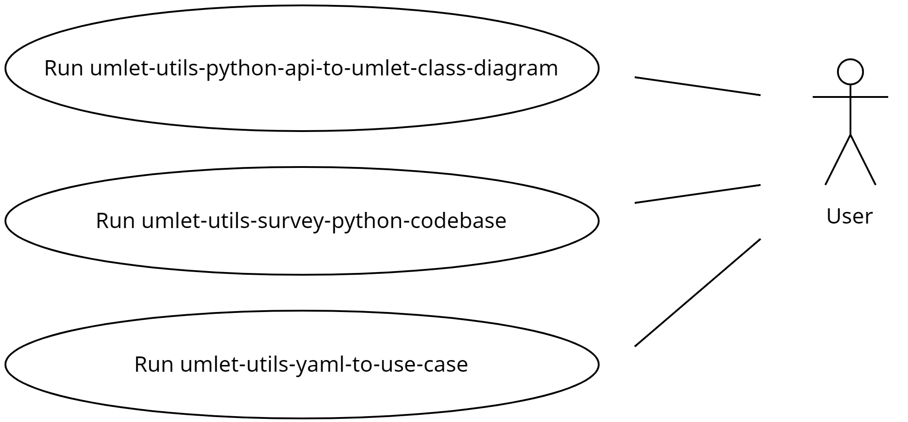
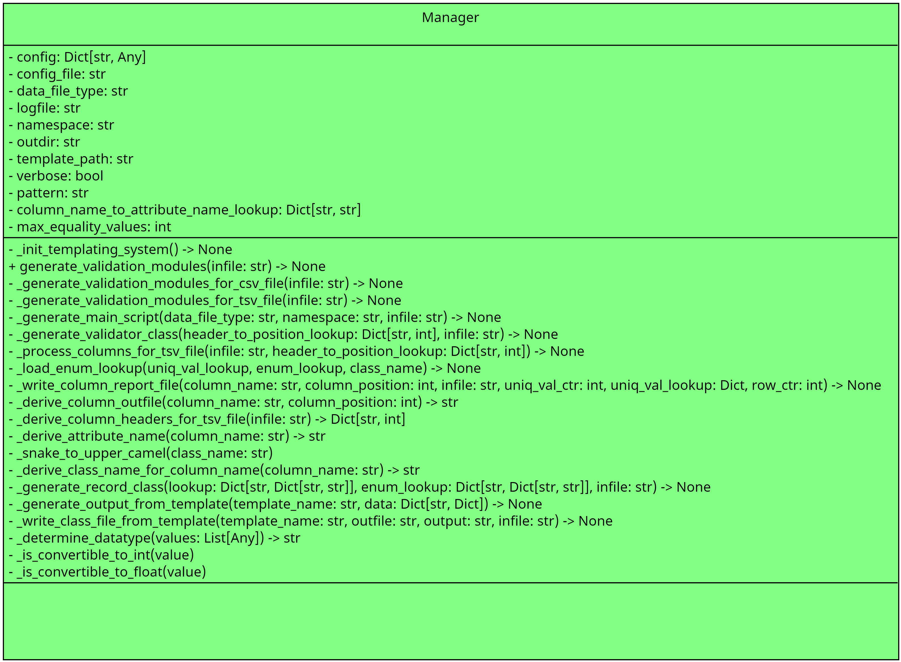

# umlet-utils

Software for generating Umlet class diagrams of a Python code base.

Reference: https://www.umlet.com/

- [umlet-utils](#umlet-utils)
  - [Motivation](#motivation)
  - [Improvements](#improvements)
  - [Use Cases](#use-cases)
  - [Class Diagrams](#class-diagrams)
  - [Installation](#installation)
  - [Exported scripts](#exported-scripts)
  - [Contributing](#contributing)
  - [To-Do/Coming Next](#to-docoming-next)
  - [CHANGELOG](#changelog)
  - [License](#license)

## Motivation

Creating class diagrams can be a tedious process. 
This software can automatically read a Python codebase 
and then generate a UMLet .uxf file contain the class diagrams.

## Improvements

Please see the [TODO](docs/TODO.md) for a list of upcoming improvements.

## Use Cases

## Class Diagrams

## Installation

Please see the [INSTALL](docs/INSTALL.md) guide for instructions.

## Exported scripts

The following exported console scripts are available:

- umlet-utils-python-api-to-umlet-class-diagram
- umlet-utils-survey-python-codebase
- umlet-utils-yaml-to-use-case

## Contributing

Pull requests are welcome. For major changes, please open an issue first
to discuss what you would like to change.

## To-Do/Coming Next

Please view the listing of planned improvements [here](docs/TODO.md).

## CHANGELOG

Please view the CHANGELOG [here](docs/CHANGELOG.md).

## License

[GNU AFFERO GENERAL PUBLIC LICENSE](LICENSE)
